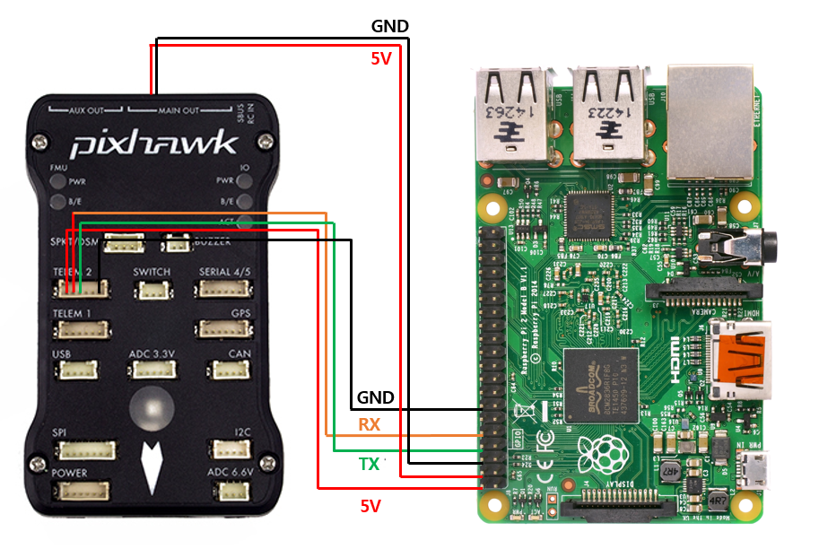

<h4>Last update: April-2025</h4>

<h2>Aerial Robotics: Drone Development - I</h2>

<h3>I. PixHawk Setup</h3>
<ol>
    <li> Download and install Ardupilot mission planner:<br/> 
    <a href="https://ardupilot.org/planner/docs/mission-planner-installation.html"> Ardupilot Mission Planner</a>
    </li>
    <li> Setup PixHawk on mission planner program
    </li>
</ol>


<h3>II. RPi-PixHawk Connection</h3>

--> Refer to <br>(YouTube)-><a href="https://www.youtube.com/watch?v=nIuoCYauW3s&t=246s"> How to Connect PixHawk to Raspberry Pi</a> <br>(YPX4 Guide)-> <a href="https://docs.px4.io/main/en/companion_computer/pixhawk_rpi.html"> HRaspberry Pi Companion with Pixhawk</a>


1. Setup Raspberry Pi
    - Connect RPi GPIO pins to Telemetry2 on pixhawk 
    - 5 V vcc, GND, TXD(pin #14), RXD(pin #15) 

    

2. Enable Serial Port

    ```sh
    $ sudo raspi-config
        --> Serial Port
        --> login shell to be accessible over serial: "NO"
        --> serial port hardware to be enabled: "YES"

    # Verify either "/dev/ttyAMA0" or "/dev/serial0"
    $ ls /dev/tty*
    $ ls /dev/serial0
        
    ```
3. Install APIs / libraries

    ```sh
    $ sudo apt install python3-dev
    $ sudo apt install python3-opencv
    $ sudo apt install python3-wxgtk4.0
    $ sudo apt install python3-matplotlib
    $ sudo apt install python3-lxml
    $ sudo apt install libxml2-dev
    $ sudo apt install libxslt-dev

    # No virtual environment programming recommended in RPi-python Programming
    # Utilize system-wide python packages 
    $ sudo pip install PyYAML --break-system-package
    $ sudo pip install mavproxy --break-system-package 

    ```

3. Connection Test with mavproxy

    ```sh
    $ sudo mavproxy.py --master=/dev/ttyAMA0
    $ sudo mavproxy.py --master=/dev/serial0
    
    ```

4. Programming with python-package: mavsdk

    ```sh
    $ sudo pip install mavsdk --break-system-package 
    
    ```
    
Refer to --> <br> (Documentation) 
<a href=http://mavsdk-python-docs.s3-website.eu-central-1.amazonaws.com/index.html> MAVSDK-Python API Reference</a><br> (GitHub with examples)
<a href=https://github.com/mavlink/MAVSDK-Python> mavlink/MAVSDK-Python</a>


    ``` py
    # Connection Test Code: Sangmork Park at VMI
 
    import asyncio
    from mavsdk import System

    async def main() -> None:
        drone = System()
        print("Connecting to drone...")

        await drone.connect(system_address="serial:///dev/serial0:57600")

        async for state in drone.core.connection_state():
            if state.is_connected:
                print(f"-- Connected to drone!")
                break

        print("Getting version...")
        version = await drone.info.get_version()
        # version = await drone.version_info().version
        print(f"Drone version:{version}")

    #     print("Disablint the vehicle")
        print("Example complete")

if __name__ == '__main__':
    asyncio.run(main())

    ```


<h3>III. Drone Programming</h3>

<h4>Drone</h4>

1. Drone Hardware

2. Flight Controller Hardware: PixHawk, RPi, ...

3. Flight Controller Software: Ardupilot, APM, PX4, ...

<h4>Communication Layer (Middleware) </h4>

1. Telemetry Module

2. MAVLINK

<h4>Ground Control</h4>

1. GCS Hardtware: Laptop, ....

2. GCS Software: QGroundControl, APM Planner, Mission Planner, "YOUR" Application, ....

3. Software Development API: DROKEKIT, ....


<h4>Ardupilot and SITL Setup</h4>

- Dowunload from GitHub Ardupilot and Setup environment 

    ``` sh
    # check the latest ardupilot firmware version ....
    $ git clone -b Copter-4.5.5 https://github.com/ardupilot/ardupilot
    $ cd ardupilotcd 
    $ git submodule update --init --recursive

    $ Tools/environment_install/install-prereqs-ubuntu.sh -y

    $ cd ardupilot
    $ ./waf list_boards

    # launch SITL simulator
    $ cd ArduCopter
    $ Tools/autotest/sim_vehicle.py --console --map -w

    # if pymavelink import problem meet
    $ git submodule update --init --recursive
    
    # if empy error meet
    $ sudo python -m pip install empy==3.3.4
    
    # if unable to find mavproxy.py error meet
    $ sudo pip install -U mavproxy
    ```
- What sim_vehicle.py do are
    
    1. Detect what vehicle to build for (Copter, Plane, Rover, ....)
    2. Compiles the necessary source code and produce an executable
    3. Launches the simulated drone by running the SITL executable
    4. Launches MAVProxy to communicate with the drone on SITL.

<h4>Dron Kit Install</h4>

```
$sudo -H pip install dronekit==2.9.2
$sudo -H pip install dronekit-sitl==3.3.0

```

<h4>Dron Kit Script Error Correction</h4>

1. ERROR: class Parameter(collections.MutableMapping, HasObservers) ... <br/>
-> go to "site-packages/dronekit/__inin__.py" line 2689 and revise "class Parameters(collections.MutableMapping, ...)" to "class Parameters(collections.abc.MutableMapping, ...)"

 


